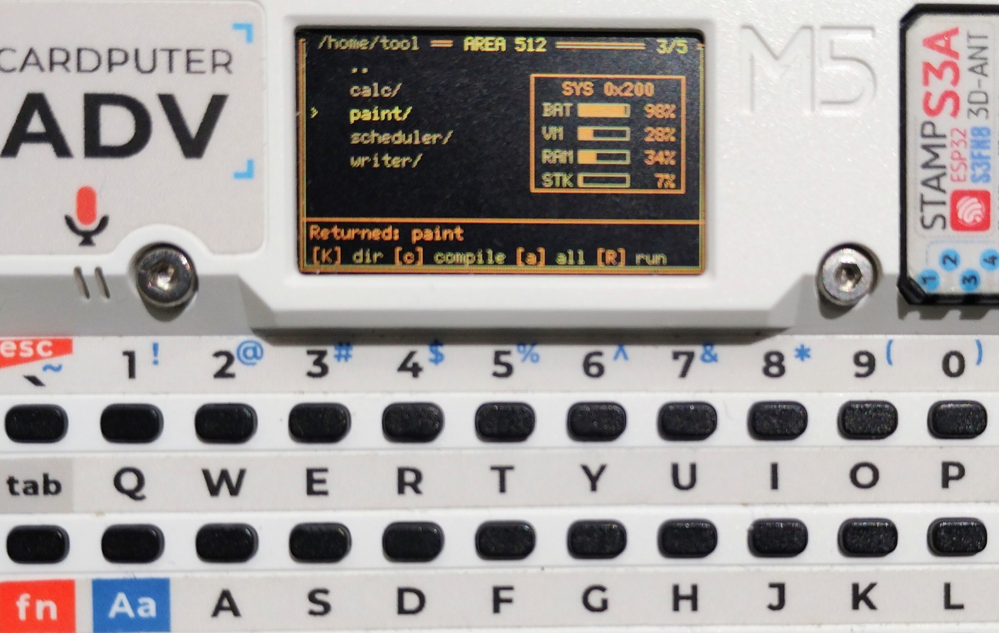
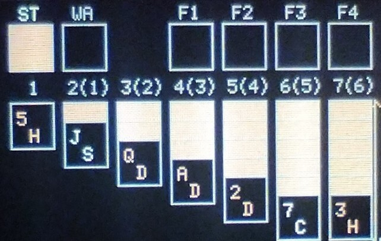
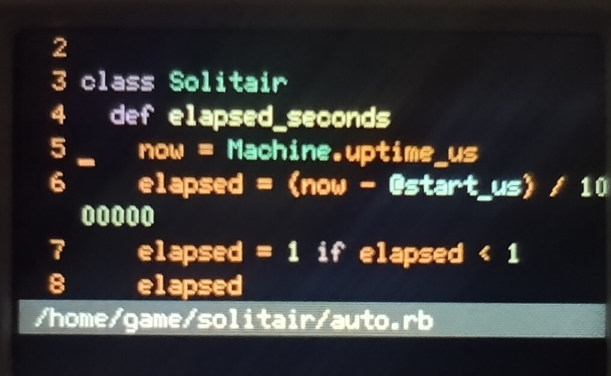

# AREA512

<p align="center">
  
</p>

Welcome to AREA512!

AREA512 is an OS built for the Cardputer ADV,
a tiny device with just 512KB of RAM and 8MB of flash storage!

It is based on FemtoRuby,
so you can write Ruby right on the Cardputer,
then compile and run it — all on the device!

## Quick Install

All you need is esptool:

```sh
pip install esptool
make flash-firmware
```

- If the port is not auto-detected, specify it like `ESPPORT=/dev/ttyACM0 make flash-firmware`.
- Insert a FAT32-formatted microSD card into the Cardputer ADV (it is used to store app data).

## Using AREA512



The screen shows a listing of the current directory: directories first, then applications (`.rb` / `.mrb` are merged into a single entry without the extension), then other files.

The following keys are available.

| Key | Action |
| --- | --- |
| `;` / `.` (or `k` / `j`) | Move the cursor up / down |
| `/` or Enter | Open (enter a directory / run an app) |
| `,` or BS | Go to the parent directory |
| `1`–`9` | Jump to the n-th entry |
| `e` | Edit the selected file |
| `c` | Compile the selected app's `.rb` |
| `a` | Compile every `.rb` in the current directory |
| `R` | Run the selected directory as an application |
| `N` | Create a new file (you type the name) |
| `K` | Create a new directory (you type the name) |
| `x` | Delete (asks `y/n` for confirmation) |
| `m` | Move the selected entry (you type the destination path) |
| `r` | Reboot the device |
| `q` | Quit the file manager |

## Applications



The following come preinstalled under `/home/tool` and `/home/game`.

Each app's directory also contains a README explaining how to use it!

<table>
  <tr>
    <td></td>
    <td></td>
    <td></td>
  </tr>
  <tr>
    <td></td>
    <td></td>
    <td></td>
  </tr>
</table>

### Writer — `/home/tool/writer`

A word processor. From business documents to poetry, write anything you like!

### Scheduler — `/home/tool/scheduler`

The greatest schedule management software.

### Calc — `/home/tool/calc`

A spreadsheet. Manage all of your money.

### Paint — `/home/tool/paint`

Draw anything!

### Solitair — `/home/game/solitair`

The world's finest card game. Compete for the high score!

### Bomb — `/home/game/bomb`

Launch it and you'll get it! That nostalgic game!

## Editing Code

The editor opened with `e` is a tiny vim running on the device. It has normal, insert, visual, operator, and command modes, plus search — with syntax highlighting. The keys your fingers remember mostly just work!



| Command | Action |
| --- | --- |
| `:w` | Save |
| `:q` | Quit (refuses if there are unsaved changes) |
| `:q!` | Quit without saving |
| `:wq` / `:x` | Save and quit |

## Compiling and Running

The device compiles `.rb` into `.mrb` (bytecode) on the spot (see `c` / `a` in the key list).
Everything runs inside a sandbox.

## Application Development

New applications should follow this layout.

### Directory Layout

An application is a single directory. Press `R` in the file manager to run it.

```
myapp/
├── main.manifest   # optional: lists the .mrb files to load, one per line
├── main.mrb        # entry point when there is no main.manifest
├── *.rb / *.mrb    # your modules
└── image.h         # optional: splash image shown at launch
```

- If `main.manifest` exists, the listed `.mrb` files are loaded into a single sandbox in order. Put dependencies first and `main.mrb` last.
- Without `main.manifest`, only `main.mrb` is executed.
- If neither exists, `No main.manifest or main.mrb` is shown.

## Building

### Requirements

- ESP-IDF v5.5+
- Ruby + Bundler
- M5 Cardputer ADV
- USB-C cable

### Setup

```sh
git clone --recursive git@github.com:engneer-hamachan/area512-dev.git
cd area512-dev
. $YOUR_ESP_IDF_PATH/export.sh
rake setup
```

If you already cloned without `--recursive`:

```sh
git submodule update --init --recursive
```

### Build and Flash

```sh
rake build
rake flash
```

Files under `storage/` are embedded in the firmware as seed content and
restored to the SD card's `Area512_data/` directory on first boot (each
top-level directory is only written if it does not exist yet on the card).

## Contributing

AREA512 welcomes contributions of new apps and AREA512 artwork (splash images and such)!

## License

[MIT License](LICENSE)
