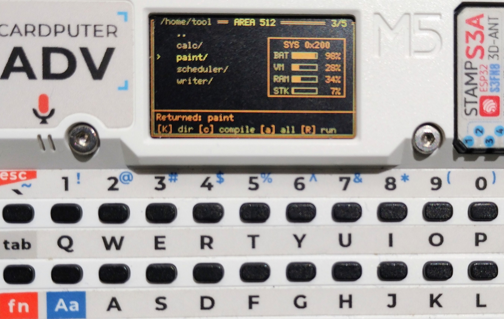
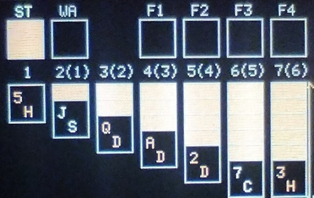
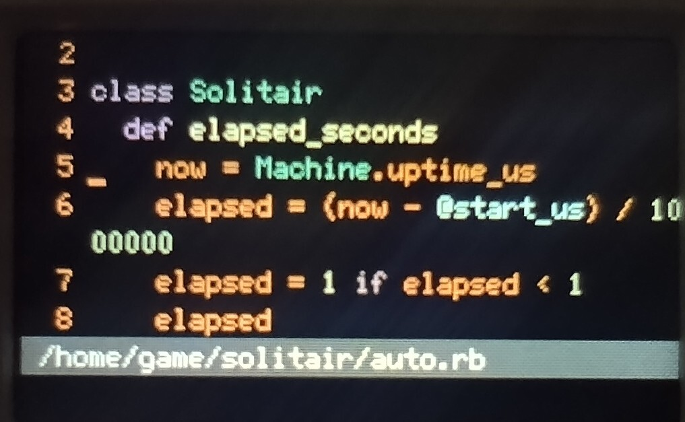

# AREA512

<p align="center">
  
</p>

Welcome to AREA512!

AREA512 is an OS built for the Cardputer ADV and Cardputer v1.1,
a tiny device with just 512KB of RAM and 8MB of flash storage!

It is based on FemtoRuby and includes MicroPython,
so you can write Ruby and Python right on the Cardputer,
then compile and run them — all on the device!

## Quick Install

All you need is esptool:

```sh
pip install esptool

# Cardputer ADV
esptool.py -c esp32s3 -b 460800 write_flash --flash_mode dio --flash_size 8MB --flash_freq 80m 0x0 firmware/Area512Adv.bin

# Cardputer v1.1
esptool.py -c esp32s3 -b 460800 write_flash --flash_mode dio --flash_size 8MB --flash_freq 80m 0x0 firmware/Area512V11.bin
```

- If the port is not auto-detected, add `-p /dev/ttyACM0` to the `esptool.py` command.
- Insert a FAT32-formatted microSD card into the Cardputer (it is used to store app data).

## Using AREA512



The screen shows a listing of the current directory: directories first, then files. Source files (`.rb` / `.py`), compiled files (`.mrb` / `.mpy`), and dot images (`.a5d`) are shown as separate entries with their extensions.

The following keys are available.

| Key | Action |
| --- | --- |
| `;` / `.` (or `k` / `j`) | Move the cursor up / down |
| `/` or Enter | Open (enter a directory / run a Ruby or Python file / view a Markdown file / edit an `.a5d` dot image) |
| `,` or BS | Go to the parent directory |
| `1`–`9` | Jump to the n-th entry |
| `e` | Edit the selected file |
| `c` | Compile the selected `.rb` or `.py` file |
| `a` | Compile every `.rb` and `.py` file in the current directory |
| `R` | Run the selected directory as an application |
| `N` | Create a new file (you type the name) |
| `K` | Create a new directory (you type the name) |
| `x` | Delete (asks `y/n` for confirmation) |
| `m` | Move the selected entry (you type the destination path) |
| `t` | Open the terminal |
| `r` | Reboot the device |
| `q` | Quit the file manager |

## Terminal

Press `t` to work in a terminal instead of the list. It shares the current
directory with the file manager, and `exit` returns to the list.

| Command | Action |
| --- | --- |
| `cd [path]` | Change directory (without an argument, go to `/home`) |
| `ls [path]` | List the current or the given directory |
| `pwd` | Print the current directory |
| `run <name>` | Run a Ruby or Python file, or a directory as an application |
| `vim <name>` | Edit a file; a name that does not exist yet is created |
| `md <name>` | View a Markdown file |
| `dot <name>` | Edit an `.a5d` dot image |
| `compile <name>` | Compile a `.rb` or `.py` file |
| `compile --all [path]` | Compile every `.rb` and `.py` file in the directory |
| `touch <name>` | Create a file |
| `mkdir <name>` | Create a directory |
| `rm <name>` | Delete (asks `y/n` for confirmation) |
| `mv <src> <dst>` | Move |
| `cp <src> <dst>` | Copy |
| `irb` | Start the Ruby REPL |
| `python-repl` | Start the MicroPython REPL |
| `top` | Show battery, VM, RAM, and stack usage |
| `clear` | Clear the output |
| `help` | List the commands |
| `reboot` | Reboot the device |
| `exit` | Return to the file list |

The following keys are available on the command line.

| Key | Action |
| --- | --- |
| Left / Right | Move the cursor |
| Up / Down | Recall the command history |
| Tab | Complete the command or entry name at the cursor |
| `Ctrl-F` | Accept the suggestion shown after the cursor |
| Esc | Clear the line |

### REPL

`irb` runs Ruby and `python-repl` runs MicroPython on the console. Both read
further lines while the input is incomplete, showing `...>` (Ruby) or `...`
(Python) instead of the `irb>` / `>>>` prompt. `irb` prints `=> ` and the
result of each line. Esc returns to the terminal, and `Ctrl-C` discards the
line being typed.

## Applications



The following come preinstalled under `/home/tool` and `/home/game`.

Each app's directory also contains a README explaining how to use it!

<table>
  <tr>
    <td></td>
    <td></td>
    <td></td>
  </tr>
  <tr>
    <td></td>
    <td></td>
    <td></td>
  </tr>
</table>

### Writer — `/home/tool/writer`

A word processor. From business documents to poetry, write anything you like!

### Scheduler — `/home/tool/scheduler`

The greatest schedule management software.

### Calc — `/home/tool/calc`

A spreadsheet. Manage all of your money.

### Paint — `/home/tool/paint`

Draw anything!

### Solitair — `/home/game/solitair`

The world's finest card game. Compete for the high score!

### Bomb — `/home/game/bomb`

Launch it and you'll get it! That nostalgic game!

### Space Lander — `/home/game/space_lander`

A lunar landing game written in Python.

### Slide — `/home/tool/slide`

Displays numbered Markdown files as slides. Add files such as `1.md`, `2.md`,
and `3.md` to `/home/tool/slide`; they are displayed in numeric order.

Supported Markdown syntax:

- `#`, `##`, and `###` headings
- Lists starting with `-`
- Inline code enclosed in backticks
- Ruby code blocks enclosed in `` ```ruby `` and `` ``` ``

| Key | Action |
| --- | --- |
| `h` / `l` | Previous / next page |
| `j` / `k` | Scroll down / up |
| Esc | Quit |

### Gallery — `/home/tool/gallery`

A gallery of the built-in Widget components.

## Editing Code

The editor opened with `e` is a tiny vim running on the device. It has normal, insert, visual, operator, and command modes, plus search. Ruby and Python files have syntax highlighting, automatic indentation, code completion, diagnostics, and hover information. The keys your fingers remember mostly just work!

In insert mode, press `Ctrl-N` to open completion; it also opens automatically after `.` and uppercase letters in `.rb` and `.py` files.



| Command | Action |
| --- | --- |
| `:w` | Save |
| `:q` | Quit (refuses if there are unsaved changes) |
| `:q!` | Quit without saving |
| `:wq` / `:x` | Save and quit |

## Compiling and Running

The device compiles `.rb` into `.mrb` and `.py` into `.mpy` (bytecode) on the spot (see `c` / `a` in the key list). Ruby bytecode runs inside a sandbox, and Python bytecode runs with MicroPython.

## Application Development

New applications should follow this layout.

### Available Features

AREA512 provides the following features as built-ins. PicoRuby does not require
`require`, and MicroPython does not require `import`, to use them.

| Feature | PicoRuby | MicroPython |
| --- | --- | --- |
| Display | Yes | Yes |
| Sprite | Yes | Yes |
| Dot | Yes | Yes |
| Widget | Yes | Yes |
| WidgetList | Yes | Yes |
| WidgetTextView | Yes | Yes |
| GPIO | Yes | Yes |
| ADC | — | Yes |
| I2C | Yes | — |
| SD / File / Dir | Yes | Yes |
| IO | Yes | Yes |
| RNG | Yes | Yes |
| Sandbox | Yes | — |
| Console | — | Yes |

See [PicoRuby features](PicoRuby.md) and
[MicroPython features](MicroPython.md) for the available APIs.

### Directory Layout

An application is a single directory. Press `R` in the file manager to run it.

```
myapp/
├── main.manifest   # optional: lists .mrb or .mpy files to load, one per line
├── main.mrb        # Ruby entry point when there is no main.manifest
├── main.mpy        # Python entry point when there is no main.manifest or main.mrb
├── *.rb / *.mrb    # Ruby modules
├── *.py / *.mpy    # Python modules
└── image.h         # optional: splash image shown at launch
```

- If `main.manifest` lists `.mrb` files, they are loaded into a single sandbox in order. Put dependencies first and `main.mrb` last.
- If `main.manifest` lists `.mpy` files, MicroPython runs them in order. Put dependencies first and `main.mpy` last.
- Without `main.manifest`, `main.mrb` is executed if it exists; otherwise, `main.mpy` is executed.
- If none exists, `No main.manifest, main.mrb or main.mpy in <directory>` is shown.

Applications can use the built-in Widget components directly. See [the Widget component documentation](components/area512/mrbgems/picoruby-area512-widget/README.md) and the preinstalled `/home/tool/gallery` app.

## Theme

Colors are read from `/sdcard/Area512_data/etc/theme` at boot. Without that file the defaults below are used. Edit it and reboot to apply.

```
background=0x000000
text=0xCFA45F
emphasis=0xF5972D
border=0xF5972D
selected=0xFFD966
box=0x241604
```

One `key=0xRRGGBB` per line; six hex digits, `0x` required. Lines without `=` and unknown keys are ignored.

Bitmaps (the boot logo and an application's `image.h`) are drawn with `emphasis` and `background` only, the brighter of the two used for the set bits.

## Default UI

The UI the device starts in is read from `/sdcard/Area512_data/etc/ui` at boot.
Without that file the file manager is used.

```
default=terminal
```

`default=terminal` starts in the terminal, `default=graphical` starts in the
file manager. Lines other than these two are ignored.

## Building

### Requirements

- ESP-IDF v5.5+
- Ruby + Bundler
- M5 Cardputer ADV or Cardputer v1.1
- USB-C cable

### Setup

```sh
git clone --recursive git@github.com:engneer-hamachan/area512-dev.git
cd area512-dev
. $YOUR_ESP_IDF_PATH/export.sh
rake setup
```

If you already cloned without `--recursive`:

```sh
git submodule update --init --recursive
```

### Build and Flash

```sh
# Cardputer ADV build
rake build

# Cardputer v1.1 build
rake build:v1.1

rake flash
```

Files under `storage/` are embedded in the firmware as seed content and
restored to the SD card's `Area512_data/` directory on first boot (each
top-level directory is only written if it does not exist yet on the card).

## Contributing

AREA512 welcomes contributions of new apps and AREA512 artwork (splash images and such)!

## License

[MIT License](LICENSE)
