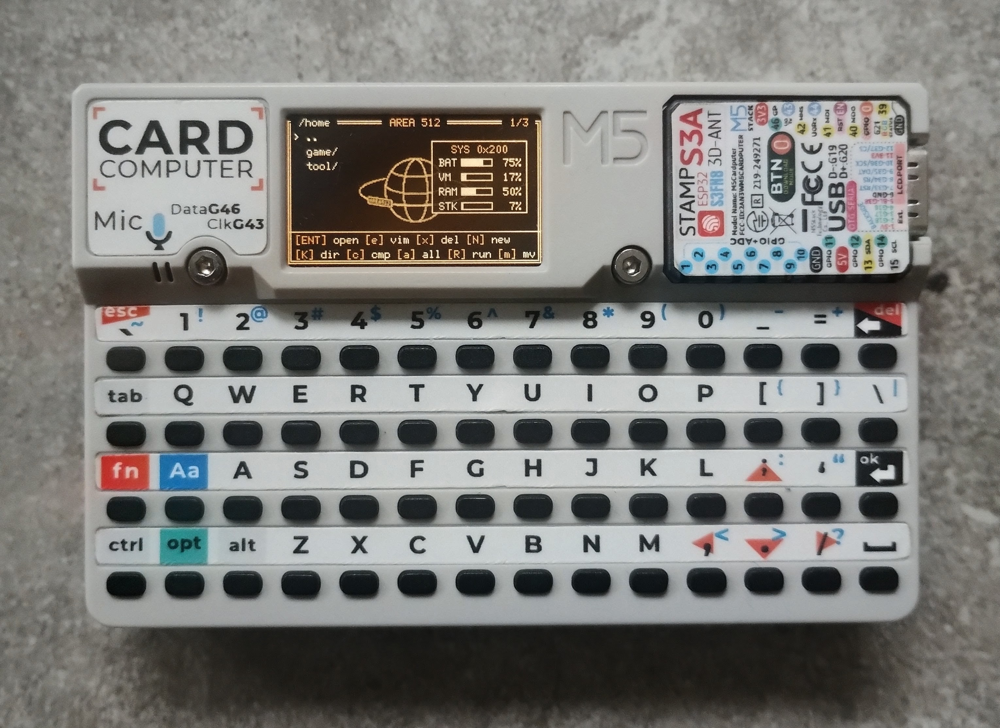
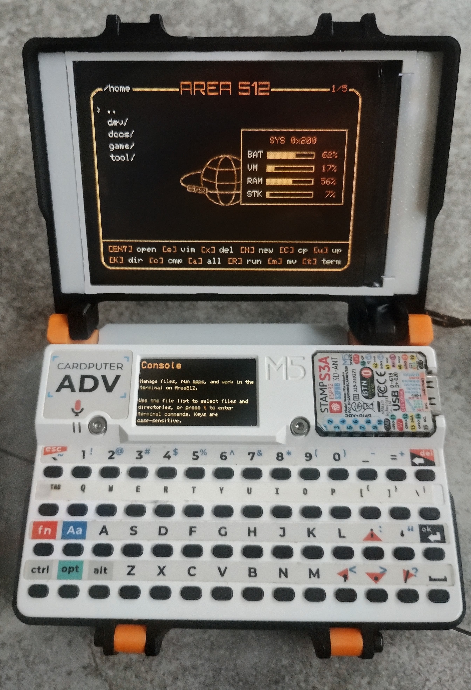
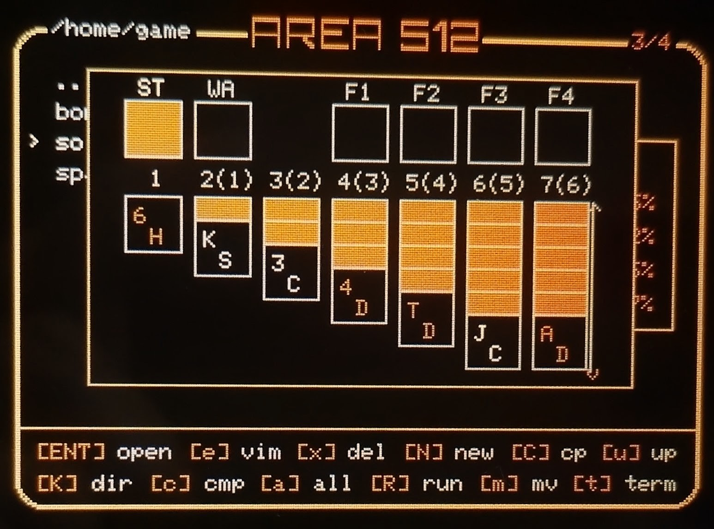
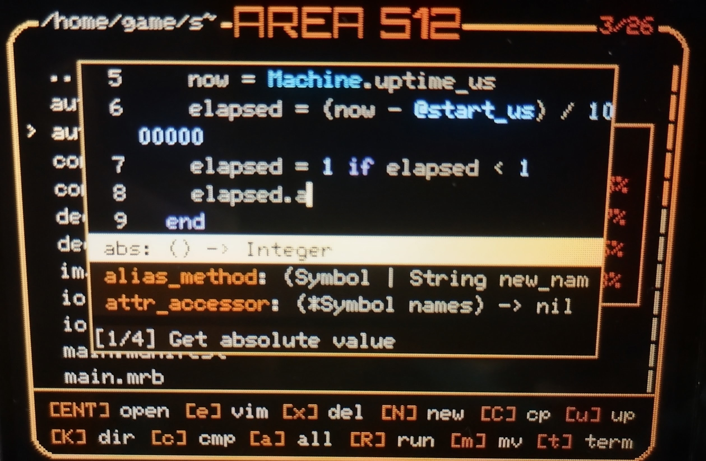

# AREA512

<p align="center">
  
</p>

Welcome to AREA512!

AREA512 is an OS built for the Cardputer ADV and Cardputer v1.1,
a tiny device with just 512KB of RAM and 8MB of flash storage!

It is based on FemtoRuby and includes MicroPython,
so you can write Ruby and Python right on the Cardputer,
then compile and run them — all on the device!

[Website](https://engneer-hamachan.github.io/area512/) · [Installation](https://engneer-hamachan.github.io/area512/install.html) · [Manual](https://engneer-hamachan.github.io/area512/manual.html)

## Supported Devices

AREA512 supports Cardputer ADV and Cardputer v1.1, either on their own or with the TERM512 external display and case.

> [!TIP]
> Build the external display and case: **[TERM512 on GitHub →](https://github.com/Prokuon/term512)**
> Then flash the binary for your display in [Quick Install](#quick-install).

<table align="center">
  <tr>
    <th>Cardputer</th>
    <th>Cardputer + TERM512</th>
  </tr>
  <tr>
    <td></td>
    <td></td>
  </tr>
</table>

## Applications



Write documents with Writer, organize your days with Scheduler, work with
spreadsheets in Calc, or draw with Paint. Take a break with Solitair, Bomb,
and Space Lander, a lunar landing game written in Python.

Apps come preinstalled under `/home/tool` and `/home/game`, with a README in
each app directory. Slide, Gallery, Theme, and the Dot editor provide tools
for presentations, exploring widgets, and customizing your device.

[Explore the applications](https://engneer-hamachan.github.io/area512/applications.html) · [App controls](https://engneer-hamachan.github.io/area512/manual.html#applications)

## On-device Programming



Write Ruby and Python right on the Cardputer. The built-in vim-style editor
provides syntax highlighting, automatic indentation, code completion,
diagnostics, and hover information. Edit, compile, and run your code on the
device, or try ideas interactively in the Ruby and MicroPython REPLs.

Built-in APIs cover graphics, sprites, widgets, files, and hardware access.
The preinstalled apps are examples you can read and build on.

[Programming guide](https://engneer-hamachan.github.io/area512/programming.html) · [Ruby API](https://engneer-hamachan.github.io/area512/ruby-api.html) · [MicroPython API](https://engneer-hamachan.github.io/area512/python-api.html) · [Widget API](https://engneer-hamachan.github.io/area512/widget-api.html)

## Quick Install

All you need is esptool:

```sh
pip install esptool

# Cardputer ADV
esptool.py -c esp32s3 -b 460800 write_flash --flash_mode dio --flash_size 8MB --flash_freq 80m 0x0 firmware/Area512Adv.bin

# Cardputer v1.1
esptool.py -c esp32s3 -b 460800 write_flash --flash_mode dio --flash_size 8MB --flash_freq 80m 0x0 firmware/Area512V11.bin

# 320x240 ST7789 panel
esptool.py -c esp32s3 -b 460800 write_flash --flash_mode dio --flash_size 8MB --flash_freq 80m 0x0 firmware/Area512TFT7789.bin

# 320x240 ILI9341 panel
esptool.py -c esp32s3 -b 460800 write_flash --flash_mode dio --flash_size 8MB --flash_freq 80m 0x0 firmware/Area512TFT9341.bin
```

- Insert a FAT32-formatted microSD card into the Cardputer (it is used to store app data).

See the [installation guide](https://engneer-hamachan.github.io/area512/install.html) for firmware downloads and setup details.

After startup, use `j` / `k` to select an entry, Enter to open a directory,
and Backspace to go back. Select an app directory under `/home/tool` or
`/home/game` and press uppercase `R` to run it.
See the [operation manual](https://engneer-hamachan.github.io/area512/manual.html) for more controls.

## Updating

After flashing new firmware, open the terminal with `t`, run `fullupdate`,
and answer `y` to update the preinstalled files on the microSD card.
The device reboots when the update finishes.

> [!WARNING]
> Back up your changes first. Firmware-provided files in `/etc` and
> `/share/backgrounds` are overwritten, and each preinstalled app directory
> under `/home/tool` and `/home/game` is deleted and rewritten. This removes
> edits to `etc/theme` and files you added inside those app directories.
> Your own app directories are kept.

[Update details](https://engneer-hamachan.github.io/area512/install.html#updating)

## Building for Contributors

### Requirements

- ESP-IDF v5.5+
- Ruby + Bundler
- M5 Cardputer ADV or Cardputer v1.1
- USB-C cable

### Setup

```sh
git clone --recursive git@github.com:engneer-hamachan/area512.git
cd area512
. $YOUR_ESP_IDF_PATH/export.sh
rake setup
```

If you already cloned without `--recursive`:

```sh
git submodule update --init --recursive
```

### Build and Flash

```sh
# Cardputer ADV build
rake build
rake flash

# Cardputer v1.1 build
rake build:v1.1
idf.py -B build/v11 flash
```

For the 320x240 display with a 240x135 application window:

```sh
# ST7789 panel
rake build:tft7789
idf.py -B build/tft7789 flash

# ILI9341 panel
rake build:tft9341
idf.py -B build/tft9341 flash
```

## Contributing

AREA512 welcomes contributions of new apps and AREA512 artwork (splash images and such)!

## Credits

TERM512 was designed and developed by the brilliant creator [Prokuon](https://github.com/Prokuon).

## License

[MIT License](LICENSE)
